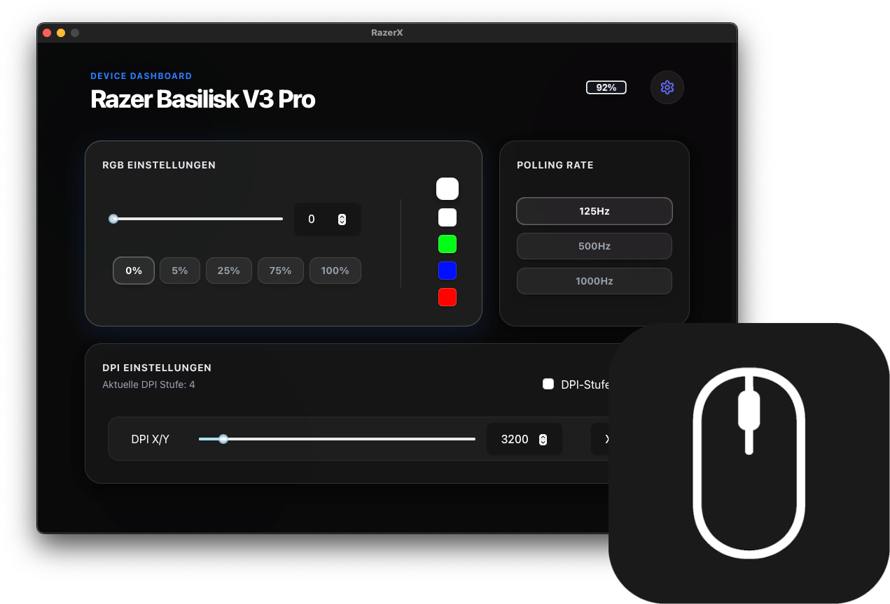

# Razer-X

<p align="center">
  
</p>

<h3 align="center">
  A cross-platform utility for controlling the Razer Basilisk V3 Pro on macOS and Linux without requiring Razer Synapse.
</h3>

## Features

### Device Control
- **DPI Configuration** - Manage DPI stages and sensitivity levels
- **Polling Rate** - Adjust hardware polling frequency (125Hz, 500Hz, 1000Hz)
- **RGB Lighting** - Background lighting color and brightness control
- **Battery Monitoring** - Real-time battery level status
- **Battery Charging** - Real-time battery charging status
- **Scroll Direction** - Dynamic scroll behavior management

### System Integration
- **Tray Icon** - System-level integration with status menu
- **Auto-Provisioning** - Automatic settings application upon device connection
- **Device Detection** - Native hotplug monitoring for receivers and wired connections
- **Power State Detection** - Intelligent monitoring of wireless mouse power states
- **Auto-Update** - optional software updates (via GitHub Releases built by a custom GitHub Actions pipeline)

## Wireless Power Management

The driver includes specialized handling for wireless mice where the USB receiver remains connected:

- **Polling-based Detection**: Monitors device state via the Razer protocol status byte.
- **State Synchronization**: Automatically applies profiles when the mouse wakes or powers on.
- **Technical Implementation**: 
  - Periodic firmware version queries (2s interval)
  - Status byte evaluation (`0x02` for active, `0x04` for standby/off)
  - Event-driven callbacks for state transitions

## System Requirements

### macOS
- macOS 10.13 (High Sierra) or later
- Native IOKit integration
- USB device access permissions

### Linux
- Current mouse driver must be based on generic USB HID (HIDRaw)
- udev rules for mouse device access

## Downloads

Prebuilt binaries are available for **macOS** and **Linux** on the **[GitHub Releases](https://github.com/PaDreyer/razer-x/releases)** page. 

If you prefer to build from source or are contributing to the project, follow the instructions below.

## Quick Start

### Prerequisites
- Rust 1.70+
- Node.js & Yarn (Tauri UI)
- Git

### Installation

```bash
# Clone the repository
git clone https://github.com/PaDreyer/razer-x.git
cd razer-x

# Build the driver
cargo build --release

# Initialize the UI
cd app
yarn install
yarn tauri dev
```

### Production Build

```bash
cd app
yarn tauri build
```

## Project Structure

The codebase is organized as a Rust workspace with the following components:

- **[app/](./app)**: **The Main Application.** This contains both the React frontend and the Tauri backend.
  - `app/src/`: React + Vite UI components and state management.
  - `app/src-tauri/`: Tauri configuration and the main Rust process (entry point).
- **[driver/](./driver)**: Hardware abstraction layer. Manages device lifecycle, connection monitoring, and command dispatching.
- **[razer/](./razer)**: Low-level protocol implementation. Handles USB HID packet construction and Razer-specific command logic.
- **[bindings/](./bindings)**: Native platform interfaces (IOKit for macOS, libusb for Linux) for direct hardware communication.

## Development

### Testing
```bash
cargo test
```

### Formatting
```bash
cargo fmt
```

### Linting
```bash
cargo clippy
```

### Debugging
```bash
RUST_LOG=debug yarn tauri dev
```

## Supported Devices

- **Razer Basilisk V3 Pro** (Wired & Wireless)

*Note: I might consider adding support for additional hardware upon request.*

## Device Management

The application automates several hardware configurations:
- Automatic hardware initialization upon detection
- Persistent settings application (DPI, Polling, Lighting)
- Context-aware scroll direction management

## Known Limitations

- Hardware support is limited to the Basilisk V3 Pro
- No Windows support planned

## Contributing

Contributions focusing on hardware support or platform stability are welcome.

### Contribution Process
1. Fork the repository
2. Create a functional branch (`git checkout -b feature/name`)
3. Commit changes with descriptive messages
4. Push to origin
5. Submit a Pull Request

## Technical Architecture

### Razer Protocol
Implemented via USB HID control transfers:
- Firmware and battery telemetry
- DPI and frequency configuration
- RGB state management
- Wireless handshake and status monitoring

### Implementation Details
**macOS:**
- IOKit-based USB communication
- IOHIDDevice event monitoring
- Compatible with macOS 10.13+

**Linux:**
- libusb implementation
- Hotplug event integration

## License

MIT License - see [LICENSE](LICENSE) for details.

## Acknowledgments

- [OpenRazer](https://github.com/openrazer/openrazer) - Protocol documentation
- [Tauri](https://tauri.app/) - Application framework

---

*Note: This is an unofficial project and is not affiliated with Razer Inc.*
